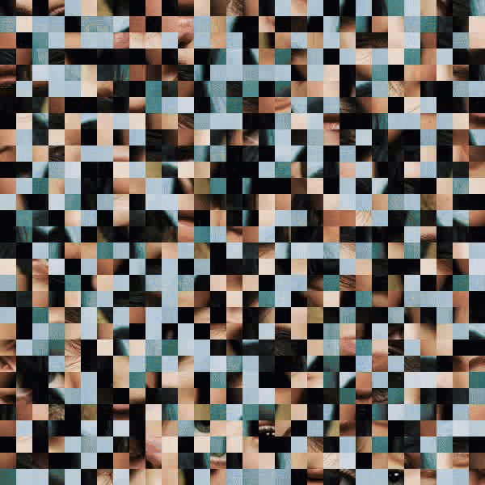

# deep model challenges

This repository uses specific videos to evaluate the performance of state-of-the-art action recognition model (two-stream I3D convnet) against visual challenges (here rapid display of targets!)

The I3D model used here (and its checkpoints) is inspired by [this repository](https://github.com/piergiaj/pytorch-i3d) with some modifications. It is pretrained on Kinetics and Charades datasets. 

[RSVPGenerator.py](RSVPGenerator.py) will create an object which will generate RSVP videos by constructing masks from stimuli and putting stimuli and masks in a rapid presentation.

[extract_frames.py](extract_frames.py) will extract rgb and optical flow (using TV-L1 algorithm) frames.
